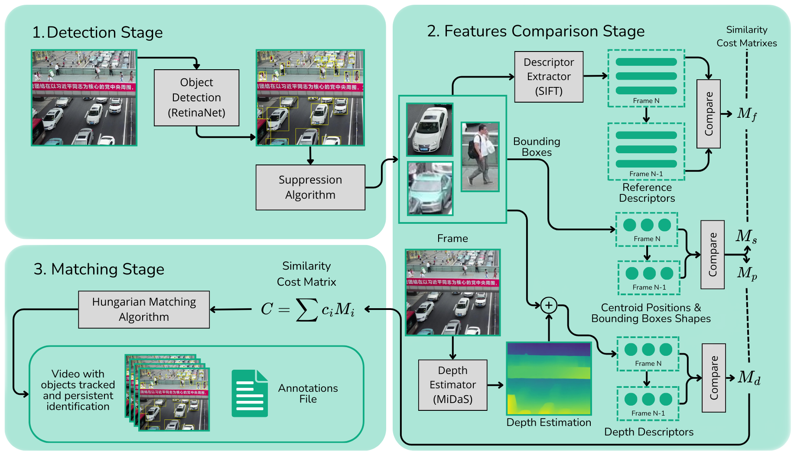

# Framework

## Matching methods advantages

### Feature

1. Allows to distinguish different looking objects

### Position

1. Allows to distinguish distant objects in the frame

### Depth

1. Allows to distinguish objects in different depths, it'd work well in the case we have similar objects near to each other but in different depths (crossing)
2. If the camera turns...
3. You can use depth to adjust threshold (?)

## Standard Deviation Calculus over Ground-Truth Data
Our goal is to calculate $\sigma_d$ where $d$ is the metric the cost matrix is related to: depth, position or visual features. Thus, the deviation is given by
$$\sigma_d = \dfrac{1}{K}\sum_{k=1}^K\sqrt{\dfrac{1}{i\times (j-1)}\sum_{i}\sum_j(d_{k,i,j+1}-d_{k,i,j})^2}$$
Where:
1. k is a ground truth sequence
2. i is an object
3. j is a frame of the sequence

For the depth and position, centroid metric will be used as reference to compare between frames and as for the visual features, pairs of frames will be compared, each object within the pair having the number of matches used as reference for the deviation calculation.
## VisDrone Docs

### VisDrone Annotations Multi-Object Tracking Header

<frame_index>,<target_id>,<bbox_left>,<bbox_top>,<bbox_width>,<bbox_height>,<score>,<object_category>,<truncation>,<occlusion>

| Position | Name                | Description                                                                                                                                                                                                                                                                                                 |
| -------- | ------------------- | ----------------------------------------------------------------------------------------------------------------------------------------------------------------------------------------------------------------------------------------------------------------------------------------------------------- |
| 1        | `<frame_index>`     | The frame index of the video frame |
| 2        | `<target_id>`       | In the DETECTION result file, the identity of the target should be set to the constant -1. In the GROUNDTRUTH file, the identity of the target is used to provide the temporal corresponding relation of the bounding boxes in different frames.|
| 3        | `<bbox_left>`       | The x coordinate of the top-left corner of the predicted bounding box|
| 4        | `<bbox_top>`        | The y coordinate of the top-left corner of the predicted object bounding box|
| 5        | `<bbox_width>`      | The width in pixels of the predicted object bounding box|
| 6        | `<bbox_height>`     | The height in pixels of the predicted object bounding box |
| 7        | `<score>`           | The score in the DETECTION file indicates the confidence of the predicted bounding box enclosing an object instance. The score in the GROUNDTRUTH file is set to 1 or 0. 1 indicates the bounding box is considered in evaluation, while 0 indicates the bounding box will be ignored. |
| 8        | `<object_category>` | The object category indicates the type of annotated object|
| 9        | `<truncation>`      | The score in the DETECTION file should be set to the constant -1. The score in the GROUNDTRUTH file indicates the degree of object parts appearing outside a frame (i.e., no truncation = 0 (truncation ratio 0%), and partial truncation = 1 (truncation ratio 1% ∼ 50%)). |
| 10       | `<occlusion>`       | The score in the DETECTION file should be set to the constant -1. The score in the GROUNDTRUTH file indicates the fraction of objects being occluded (i.e., no occlusion = 0 (occlusion ratio 0%), partial occlusion = 1 (occlusion ratio 1% ∼ 50%), and heavy occlusion = 2 (occlusion ratio 50% ~ 100%)). |

### VisDrone Classes

0: ignored regions
1: pedestrian
2: people
3: bicycle
4: car
5: van
6: truck
7: tricycle
8: awning-tricycle
9: bus
10: motor
11: others

### Yolo Classes
2: car
0: person
7: truck

## Occlusion
- displacement can be only used with optical flow replacing position as predicted position
- maybe if PREDICT.IOU(EVERY ONE) == 0 then create bb else do nothing

## Distant Objects Anomaly
- Let's see if changing the suppresion from Parallel-NMS to Confluence solves the problem

## Tune the weights
Use ground truth annotations to calculate the errors in metrics (depth, position, features) between the same object in different frames and divide an equipotent weight for the standard deviation over this errors. Each weight would be divided by the standard deviation calculated for its metric over a set of sequences.(done)

The article 3 defends weigths baesd in feature stability, beyond the standard deviations there should be an unbaleced wieght vector for prioritizing stable features 

## Problems

- When an object goes out of the image, it has less features for doing the pairing. A solve would be not depend so much in the visual features by applying the position metric to the cost_matrix
- Occlusion. Apply optical flow would make the system more robust to partial occlusion
- Overlapping bounding boxes (it's worse in human crowd videos) (solved with NMS)
- bboxes should be an attribute of the frame, otherwise it will leave residues of old bboxes in the frames (solved)
- NMS should consider the estimated direction of the velocity and features of mask prediction (after it will have a virtual one created with optical flow ) so in crossing or ultrapassing the detection wouldn't be pruned
- detection outdoors has lower confidence scores

## Evaluation
MOTP - Multi-Object Tracking Precision

MOTA - Multi-Object Tracking Accuracy

## References

1. H. Lee, J. -S. Lee and H. -C. Choi, "Parallelization of Non-Maximum Suppression," in IEEE Access, vol. 9, pp. 166579-166587, 2021, doi: 10.1109/ACCESS.2021.3134639.

2. Bernardin, K., Stiefelhagen, R. Evaluating Multiple Object Tracking Performance: The CLEAR MOT Metrics. J Image Video Proc 2008, 246309 (2008). https://doi.org/10.1155/2008/246309

## Links

1. VisDrone: https://github.com/VisDrone/VisDrone-Dataset
2. VisDrone explanation: http://aiskyeye.com/evaluate/results-format/
